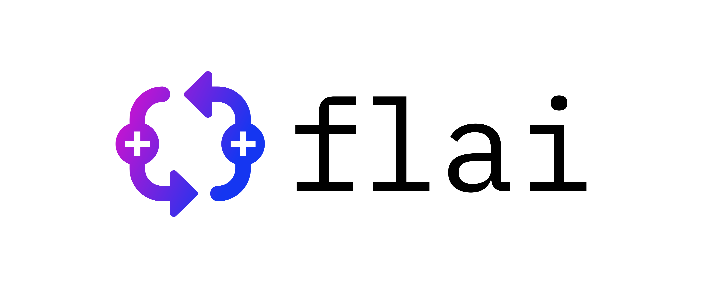

# FLAI: A toolkit for developing and comparing reinforcement learning algorithms

**[Overview](#overview)** | **[Installation](#installation)** |
**[Documentation]** |


[](http://pypi.deepair.io)

## Introduction ##
Welcome to Flai, pronounced as 'Fly!' :smiley:. Flai is toolkit for developing and comparing reinforcement learning algorithms built by [deepair](https://www.deepair.io). It is inspired by OpenAI Gym and has been modified for deepair's needs. Flai comes with pre packaged games that are designed and maintained by deepair. Get in touch with us, if you want to write your games. Currently this package is designed for deepair's internal use. Our long term goal is to open source this package, along with its games to AI research community.

## Overview
Flai is toolkit for developing and comparing reinforcement learning algorithms built by [deepair](https://www.deepair.io). It is inspired by OpenAI Gym and has been modified for deepair's needs. Flai comes with pre packaged games that are designed and maintained by deepair. Get in touch with us, if you want to write your games. Currently this package is designed for deepair's internal use. Our long term goal is to open source this package, along with its games to AI research community.. It makes no assumptions about the structure of your agent, and is compatible with any numerical computation library, such as TensorFlow.

The flai library is a collection of test problems — environments — that you can use to work out your reinforcement learning algorithms. These environments have a shared interface, allowing you to write general algorithms.

Installation
To get started, you’ll need to have Python 3.5+ installed. Simply install flai using pip:

```diff
pip install --extra-index-url http://pypi.deepair.io flai --trusted-host pypi.deepair.io
+ USERNAME: deepair
+ PASSWORD: Riapeed@2020
```

And you’re good to go!

## Working from Source

If you prefer, you can also clone the Flai Git repository directly from bitbucket. This is particularly useful when you’re working on modifying Flai itself or adding environments, games or modes. 

Download and install using:

```
git clone https://<username>@bitbucket.org/deepair/flai.git
cd flai
```
We recommend you create a virtual environment and install all the requirements from _requirements.txt_
```
virtualenv venv -p python3
source venv/bin/activate
pip install -r requirements.txt
```

## Environments
Here’s a bare minimum example of getting something running. This will run an instance of the SeatSmart Environment for 30 timesteps, rendering the environment at each step. You should see a window pop up rendering the SeatSmart game:

```
from flai import SeatSmartEnv
env = SeatSmartEnv()
env.reset()
for _ in range(30):
    env.render()
    env.step(env.action_space.sample()) # take a random action
env.close()
```

It should look something like this:


**Pro Tip**: If it is distracting, you can easily supress the window from poppoing up, by passing mode='background' while rendering the environment. This is very useful while you are training your RL agent and want to significantly speedup the process.

Normally, the simulation ends when the time the flight is sold-out or flight departs. More on that later. For now, please ignore any warnings.

Currently `SeatSmart` is the only environment that is available. We will add more in the future and these Environments will all descend from the Env base class. The `SeatSmart` environment can be run in many modes, to simulate different seatmap configurations. 

If you would like to see some other mode for the environments in action, try passing the mode as an argument. Like shown below:

```
env = SeatSmartEnv(mode = 'UO_A321')  # This will simulate a A321 configuration
```

Here are a list of modes that are available right now: `"UO_A320"`, `"UO_A321"`, `"UO_A320NEO"`

Note that if you’re missing any dependencies, you should get a helpful error message telling you what you’re missing. (Let us know if a dependency gives you trouble without a clear instruction to fix it.) Installing a missing dependency is generally pretty simple. 


## Observations
If we ever want to do better than take random actions at each step, it’d probably be good to actually know what our actions are doing to the environment.

The environment’s `step` function returns exactly what we need. In fact, step returns four values. These are:

1. `observation` (object): an environment-specific object representing your observation of the environment. For example, `Seatmap` realated context like seatmap status, number of tickets sold, number of seats sold by zone. `Customer` related context like size of the group that is going to come in the next timestep. `Time` related context like how many days to departure
1. `reward` (float): amount of reward achieved by the previous action. The scale varies between environments, but the goal is always to increase your total reward.
1. `done` (boolean): whether it’s time to reset the environment again. All games are divided up into well-defined episodes, and `done` being `True` indicates the episode has terminated. (For example, perhaps the flight is sold-out or it is time for the flight to depart)
1. `info` (dict): diagnostic information useful for debugging. It can sometimes be useful for learning (for example, it might contain the raw probabilities behind the environment’s last state change). However, official evaluations of your agent are not allowed to use this for learning.
This is just an implementation of the classic “agent-environment loop”. Each timestep, the agent chooses an action, and the environment returns an observation and a reward.

The process gets started by calling `reset()`, which returns an initial observation. So a more proper way of writing the previous code would be to respect the done flag:

```
from flai import SeatSmartEnv
env = SeatSmartEnv()
for i_episode in range(20):
    observation = env.reset()
    done = False
    while not done:
        env.render()
        print(observation)
        action = env.action_space.sample()
        observation, reward, done, info = env.step(action)
        print(reward)
env.close()
```

This should give a video and output like the following. You should be able to see where the resets happen.


## Spaces
In the examples above, we’ve been sampling random actions from the environment’s action space. But what actually are those actions? Every environment comes with an action_space and an observation_space. These attributes are of type ActionSpace and ObservationSpace respective, and they describe the format of valid actions and observations:

```
>>> from flai import SeatSmartEnv
pygame 2.0.0.dev6 (SDL 2.0.10, python 3.7.3)
Hello from the pygame community. https://www.pygame.org/contribute.html

>>> env = SeatSmartEnv()
[INFO]: New customer spawned

>>> env.observation_space
{"seats": "list", "availability": "list", "ticket_availability": "int", "current_price": "list", "sold": "list", "revenue": "list", "ticket_sold": "int", "ticket_revenue": "int", "advanced_purchase": "int", "groupsize": "int64"}

>>> env.action_space
{"upper": "ndarray", "lower": "ndarray"}
```
The `ObservationSpace` is a generic object where lots of information can be stored and in this case the environmen't observation space has the context of the flight, seatmap, customer and time. You can further analyze the observation_space for futher details.

```
>>> env.observation_space.groupsize
1
>>> env.observation_space.advanced_purchase
364
>>> env.observation_space.availability
[138, 24, 18]
```

Similary ActionSpace is a box that is defined by upper and lower bound arrays. In the context of `SeatSmart` this represents the lower and upper bound of price for each seating zone. We can check the Box's bounds:

```
>>> env.action_space.lower
array([ 30,  65, 120], dtype=int32)
>>> env.action_space.upper
array([145, 300, 480], dtype=int32)
```

It is also important to note that ActionSpace enforces that the price follow a strict heirarchy.

`zone1 < zone2 < zone3`

you can query the ActionSpace to check if an action is valid:

```
>>> [25,100,200] in env.action_space
False
>>> [45,100,200] in env.action_space
True
```

and finally, if you want to convert your action into a valid action, you can let actionspace take care of it by calling the `valid` fucntion.

```
>>> env.action_space.valid([25,100,200])
array([ 30, 100, 200], dtype=int32)
```

In the above example, since 25 was not a valid price for zone1, it was automatically boxed into the upper and lower limit.

Fortunately, the better your learning algorithm, the less you’ll have to try to interpret these numbers yourself.

## Available Environments and Modes
Today, Flai comes with one environment called `SeatSmart`. Our vision is to add more and also work with the community to create more environments focused on the travel industry. `SeatSmart` has many different pre-built modes. Here is a list of the modes that are available.

1. `UO_A320` mode - this creates a game for a typical A320 seatmap. This is also the default mode.
2. `UO_A321` mode - this creates a game for a typical A321 seatmap.
3. `UO_A320NEO` mode - this creates a game for a typical A320-NEO seatmap.

### Adding Custom Modes:
If you are working with flai source code, you will be able to compose your own modes and create brand new modes. A mode has to be defined in the `flai\envs\seatsmart\config\modes.json` folder.

A typical mode contains 6 attributes:

    "default": {
        "theme": "default",
        "seat_map_layout": "UO_A320",
        "pricing_rules": "default",
        "demand": 180,
        "arrival_distribution": "default",
        "customer": "SeatCustomer_MNL"
    },

1. **`theme`**: that defines the look and feel of the game. You can choose from various themes that are available in the `themes.json` same folder.
1. **`seat_map_layout`**: this is the layout of the seatmap as defined in the `seatmaps.json` file in the same folder. Choose any of the available seatmaps or simply define your own.
1. **`pricing_rules`**: this defines the minimum and maximum price for each zone that is defined in the seat_map_layout. Choose an existing pricing rule or create a new one in `pricing_rules.json` file. 
1. **`demand`**: number of transactions you want to simulate for every game episode. Please note that every customer will buy a ticket on the flight. But if the customer will buy a seat or not depends on your actions and the customer choice model that is defined in the mode.
1. **`customer`**: this attribute points the class that defines the customer purchase logic. The reinforcement learning agent trying to beat this customer. Feel free to pick one of the exiting customer models or create your own in `customers.py` file. 
1. **`arrival_distribution`**: this attribute controls the weekly arrival rate of customer during the game. A game lasts for one episode, which is 364 days or 52 weeks. Every time the game proceed by one step, a customer is spawned and the time moves based on the arrival rate. The sampling of arrival rate follows a poisson distribution. You can change the arrival rate so that you can train the agent for various real-life scenarios like "early booking" flight or "late booking" flight. These different distributions will be made available within `arrival_distributions.json` file. If you dont find what you are looking for, feel free to create one and add it to your custom mode.

As you can see, you have complete control on which game you want to play. The reason for keep the game configurable is because we are still evolving the environment so we wanted to make sure the environment is open both "game designers" and "RL agent designers". Ideally you should be training your reinforcement learning algorithm to train in all the different modes.

## Interactive Game
Finally, as a fun exercise we have also provide a way to play the game in a 100% interactive mode. Where you can manually spawn customers, change the offered price and see if you can beat your RL agent. Here are is how you access the game in the interactive mode.

```
>>> from flai import game
>>> game()
```
A screen should pop-up with the game running in the interactive mode. Here are few keyboard short cuts to play the game:
1. `UP_ARROW` :arrow_up: - to increase the price.
2. `DOWN_ARROW` :arrow_down: - to reduce the price.
3. `SPACE BAR` - press the key down to spawn a customer and start the transaction, and release it to complete the transaction. You can change the price while the space-bar is down.
4. `SHIFT + SPACE_BAR` - to perform 30 transactions.

Thats it, enjoy FLAI and give us your feedback. 

Please raise issues in the repository for bug, enhancement, proposal or task.  

If you are interested in creating new environments, new modes, new games, we are accepting pull requests!

### If you have any questions ###

Contact - naman@deepair.io or kartik@deepair.io

[Documentation]: docs/index.md